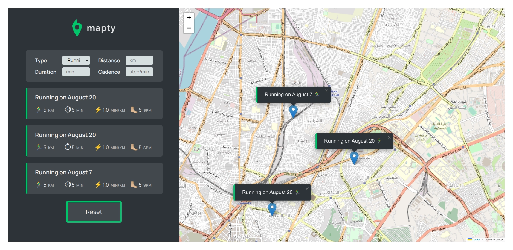

# Mapty

A single page app that allows user to store workouts on an interactive map. Written in HTML, CSS, and Vanilla JavaScript.

## Demo

You can check the demo [here](https://mapty-09.netlify.app/).

## How it works

- The browser asks for geolocation once then page is loaded, then a map is shown with current user's location.
- The user can click on any point of the map to enter workout details.
- Once a workout is submitted, it appears on the left sidebar.
- Clicking any of the recorded workouts will zoom the map to its location.

## Notes

This project is part of JavaScript Course by Jonas Schmedtmann on [Udemy](https://www.udemy.com/course/the-complete-javascript-course/).
